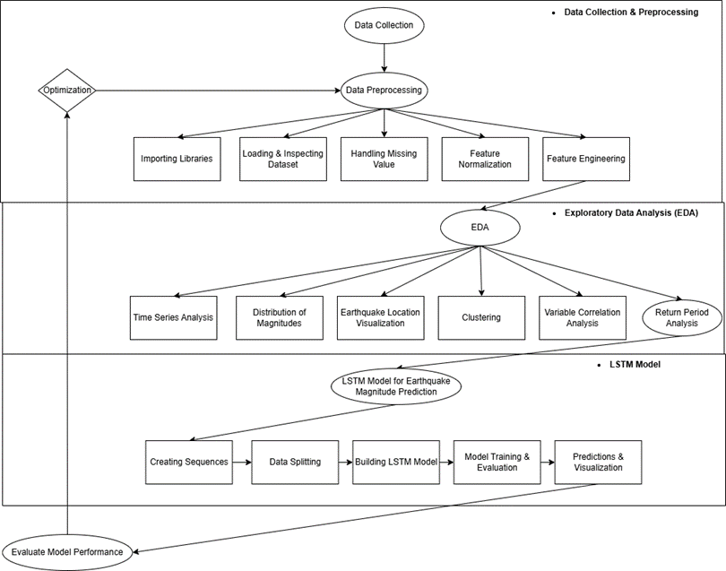

# Methodology

This research focuses on predicting earthquake recurrence periods using the Residual Long Short-Term Memory (Residual LSTM) model. The study is systematically designed in three interrelated phases.

## Phase 1: Data Collection and Preprocessing
The first phase begins with the collection of earthquake data from reliable sources, specifically the USGS earthquake repository. The collected data undergoes a comprehensive preprocessing stage, which includes importing necessary libraries, loading, and inspecting the dataset to understand its structure. Missing values are handled to improve data quality, followed by feature normalization to standardize numerical feature scales. Additionally, feature engineering is applied to create relevant new features, such as the average earthquake magnitude per year or depth prediction based on temporal patterns.

## Phase 2: Exploratory Data Analysis (EDA)
The second phase involves an in-depth Exploratory Data Analysis (EDA) to extract meaningful insights into earthquake characteristics. This analysis includes time series analysis to uncover temporal patterns of seismic events, magnitude distribution analysis to observe the dispersion of earthquake magnitudes, and earthquake location visualization to understand spatial distribution. Clustering techniques are employed to identify geographical patterns related to tectonic phenomena, and variable correlation analysis is conducted to understand relationships among variables. Additionally, recurrence period analysis is performed to estimate the recurrence of major earthquakes.

## Phase 3: Model Development and Evaluation
The third phase involves the development of the Residual LSTM model. This model integrates residual and attention mechanisms to address the Vanishing Gradient Problem (VGP) commonly encountered in traditional Recurrent Neural Networks (RNNs). The data is split into training and testing sets, and the model is trained using k-fold cross-validation. The model is then evaluated using metrics such as Root Mean Square Error (RMSE), Mean Absolute Error (MAE), and R². This phase concludes with earthquake recurrence period prediction and result visualization to validate the model's accuracy and reliability.

The entire research process is connected in an optimization cycle, where model performance evaluation results are used to refine data preprocessing and model parameters. This iterative feedback enhances prediction accuracy over time. The proposed approach enables the development of a more accurate and reliable earthquake recurrence prediction model, ultimately supporting better disaster mitigation planning.

